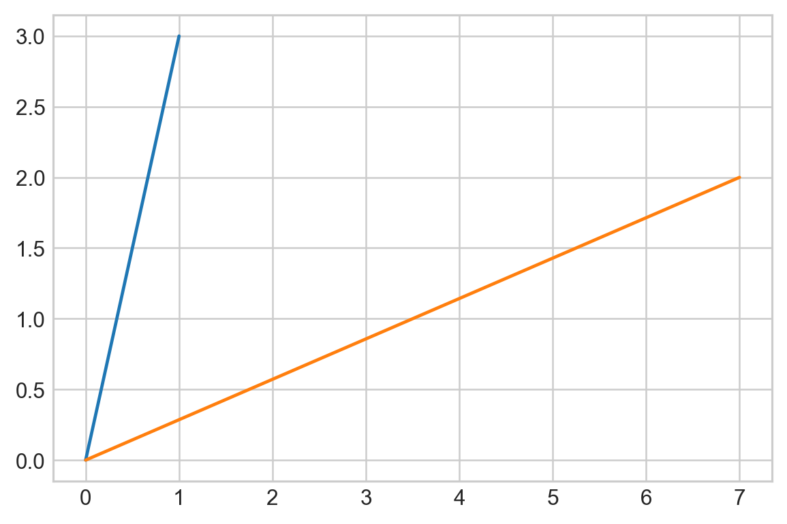

# Singular Value Decomposition (SVD)


```python
import numpy as np
import matplotlib.pyplot as plt
```


```python
x = np.array([
                [1],
                [3]
            ])
```


```python
A = np.array([
                [1,2],
                [-1, 1]
            ])
```


```python
y = np.dot(A, x)
```


```python
y
```


    array([[7],
           [2]])


```python
plt.rcParams['figure.dpi'] = 227
plt.style.use('seaborn-whitegrid')
plt.plot([0, 1], [0, 3])
plt.plot([0, 7], [0, 2])
plt.show()
```





```python
u, s, vh = np.linalg.svd(A)
```
